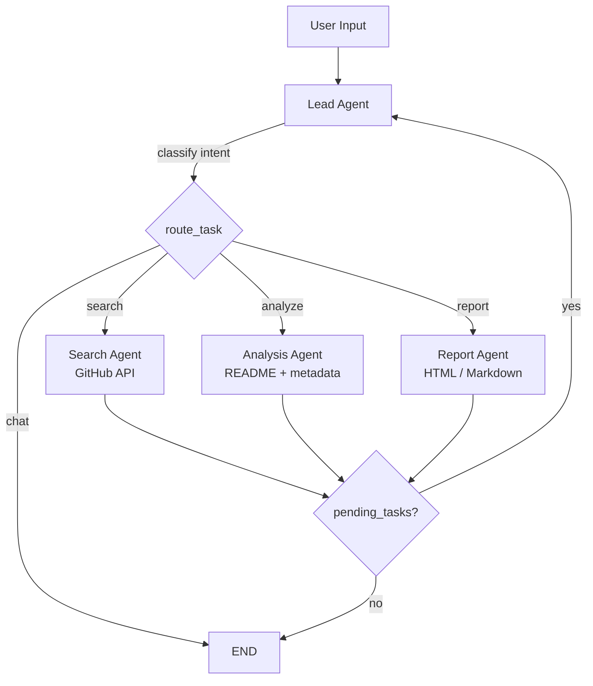

# Repo Insight

AI-powered GitHub project discovery and analysis platform with a multi-agent architecture. Built on LangChain/LangGraph, it provides intelligent search, analysis, and report generation through both a web interface and a CLI.

[README (Chinese)](README_CN.md)

## Features

- **Smart Search** — Mention any project, library, or framework by name and the system automatically searches GitHub for it, delivering a preliminary overview
- **Deep Analysis** — Request in-depth examination of specific repositories including README, metadata, languages, contributors, and structural analysis
- **Report Generation** — Export analysis results as self-contained HTML or Markdown reports with no external dependencies
- **Multi-Agent Workflow** — LangGraph-based orchestration with Lead, Search, Analysis, and Report agents that collaborate through a shared state graph
- **Composite Tasks** — Handle complex requests like "search for 5 AI projects and generate an HTML report" in a single message
- **Real-Time Streaming** — Server-Sent Events (SSE) deliver LLM tokens progressively with a client-side typewriter effect
- **Session Persistence** — SQLite-backed conversation history and cross-request state (search results, analysis data) preserved for follow-up queries
- **Language Adaptive** — Responds in the same language as the user's input (English, Chinese, etc.)
- **Dual Interface** — Web UI with session management, and a Rich-powered terminal CLI

## Architecture



**State Graph**: Each agent reads from and writes to a shared `AgentState` (messages, search_results, analysis_results, report_data, pending_tasks). The graph supports composite task decomposition — a single user message can trigger `search → analyze → report` in sequence.

## Project Structure

```
repo-insight/
├── frontend/                  # Vanilla HTML/JS/CSS web interface
│   ├── index.html
│   ├── css/style.css
│   ├── js/
│   │   ├── app.js             # Initialization, keybindings, CJK IME handling
│   │   ├── chat.js            # SSE streaming, typewriter renderer, message display
│   │   ├── session.js         # Session CRUD, sidebar, custom confirm dialog
│   │   └── report.js          # Report panel (iframe for HTML, marked.js for MD)
│   └── vendor/                # marked.js, highlight.js (bundled)
├── src/repo_insight/
│   ├── main.py                # FastAPI app, CORS, static files, DB init
│   ├── cli.py                 # Rich-powered terminal client
│   ├── config.py              # pydantic-settings configuration from .env
│   ├── agents/
│   │   ├── state.py           # AgentState (TypedDict) shared across all nodes
│   │   ├── graph.py           # LangGraph StateGraph assembly and compilation
│   │   ├── lead_agent.py      # Intent classifier + chat handler + task router
│   │   ├── search_agent.py    # GitHub search via REST API + LLM summary
│   │   ├── analysis_agent.py  # README/metadata fetch, optional deep analysis
│   │   └── report_agent.py    # LLM-generated reports, saved as HTML/Markdown
│   ├── api/routes/
│   │   ├── chat.py            # POST /api/chat — SSE streaming endpoint
│   │   ├── sessions.py        # Session CRUD endpoints
│   │   └── reports.py         # Report retrieval and download endpoints
│   ├── llm/
│   │   └── provider.py        # LLM factory (OpenAI-compatible via langchain-openai)
│   ├── storage/
│   │   ├── database.py        # SQLite init (WAL mode, foreign keys)
│   │   ├── models.py          # Pydantic models: Session, Message, Report
│   │   └── session_store.py   # Async CRUD + session context persistence
│   └── tools/
│       ├── github_search.py   # @tool: search GitHub repositories
│       ├── github_readme.py   # @tool: fetch README + repo metadata
│       ├── github_deep_analysis.py  # @tool: deep structural analysis
│       └── report_generator.py      # @tool: generate HTML/MD report files
├── tests/
│   └── diagnose_streaming.py  # SSE streaming layer-by-layer diagnostic
├── reports/                   # Generated report output directory
├── data/                      # SQLite database directory
├── pyproject.toml
└── .env.example
```

## Quick Start

### Prerequisites

- Python 3.11+
- [uv](https://docs.astral.sh/uv/) (recommended) or pip
- An OpenAI-compatible LLM endpoint (Ollama, vLLM, OpenAI, etc.)

### Installation

```bash
git clone <repo-url> && cd repo-insight

# Install dependencies
uv sync
# or: pip install -e .

# Configure environment
cp .env.example .env
# Edit .env with your LLM endpoint and optional GitHub token
```

### Configuration

Edit `.env` to match your setup:

```env
# LLM endpoint (any OpenAI-compatible API)
LLM_BASE_URL=http://127.0.0.1:11434/v1
LLM_MODEL=qwen2.5
LLM_API_KEY=ollama

# GitHub token (optional — increases rate limit from 60 to 5,000 req/hr)
GITHUB_TOKEN=ghp_your_token_here

# Server
SERVER_HOST=0.0.0.0
SERVER_PORT=8000

# Database
DB_PATH=data/repo_insight.db
```

### Running

**Web Interface:**

```bash
uv run repo-insight
# Server starts at http://localhost:8000

# Custom host and port
uv run repo-insight --host 127.0.0.1 -p 9000
```

**CLI:**

```bash
uv run repo-insight-cli
```

## API Reference

| Method | Endpoint | Description |
|--------|----------|-------------|
| `POST` | `/api/chat` | Send a message and receive SSE-streamed response |
| `GET` | `/api/sessions` | List all sessions |
| `POST` | `/api/sessions` | Create a new session |
| `GET` | `/api/sessions/{id}` | Get session details with message history |
| `PUT` | `/api/sessions/{id}` | Update session title |
| `DELETE` | `/api/sessions/{id}` | Delete a session and all associated data |
| `GET` | `/api/sessions/{id}/reports` | List reports for a session |
| `GET` | `/api/reports/{id}` | Get report content |
| `GET` | `/api/reports/{id}/download` | Download report file |

## Usage Examples

**Web UI:**
- Type `langchain` — automatically searches GitHub and shows a preliminary overview
- Type `deep dive into langchain-ai/langchain` — performs in-depth repository analysis
- Type `search for 5 AI agent frameworks and generate an HTML report` — composite task

**CLI:**
```
You: fastapi
Assistant: [Search results with overview of pallets/fastapi...]

You: analyze pallets/flask in detail
Assistant: [Deep analysis with README, structure, metrics...]

You: /report html
Assistant: [Generates self-contained HTML report]
```

**CLI Commands:**
| Command | Description |
|---------|-------------|
| `/new` | Create a new session |
| `/list` | List recent sessions |
| `/load <id>` | Load an existing session |
| `/report [html\|markdown]` | Generate a report from current session |
| `/quit` | Exit the CLI |

## Tech Stack

| Component | Technology |
|-----------|-----------|
| Agent Framework | LangChain + LangGraph |
| LLM Interface | langchain-openai (OpenAI-compatible) |
| Backend | FastAPI + Uvicorn |
| Streaming | Server-Sent Events (SSE) via sse-starlette |
| Database | SQLite + aiosqlite (WAL mode) |
| Frontend | Vanilla HTML/JS/CSS + marked.js + highlight.js |
| CLI | Rich (Markdown rendering, panels, spinners) |
| HTTP Client | httpx (async GitHub API calls) |

## License

MIT
