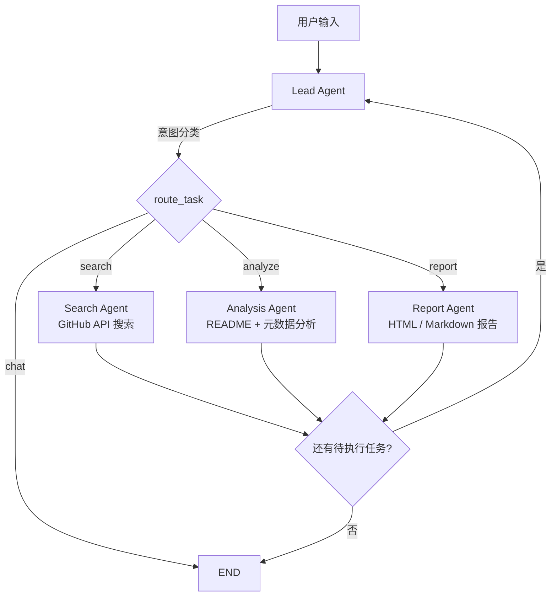

# Repo Insight

基于多智能体架构的 AI 驱动 GitHub 项目发现与分析平台。采用 LangChain/LangGraph 构建，通过 Web 界面和命令行终端提供智能搜索、深度分析和报告生成功能。

[README (English)](README.md)

## 功能特性

- **智能搜索** — 在对话中提及任意项目、库或框架名称，系统自动在 GitHub 搜索并提供初步概览
- **深度分析** — 对指定仓库进行深入分析，包括 README、元数据、编程语言、贡献者及项目结构
- **报告生成** — 将分析结果导出为完全独立的 HTML 或 Markdown 报告，无需任何外部依赖
- **多智能体协作** — 基于 LangGraph 的状态图编排，Lead、Search、Analysis、Report 四个智能体通过共享状态协同工作
- **复合任务** — 支持在单条消息中处理复杂请求，如"搜索5个AI项目并生成HTML报告"
- **实时流式输出** — 通过 SSE（Server-Sent Events）逐 token 推送，前端打字机效果渐进显示
- **会话持久化** — SQLite 存储对话历史，跨请求保持状态（搜索结果、分析数据），支持上下文追问
- **语言自适应** — 自动检测用户输入语言，以相同语言回复（支持中文、英文等）
- **双模式交互** — Web UI 提供会话管理，Rich 驱动的终端 CLI 提供 Markdown 渲染输出

## 系统架构



**状态图机制**：每个智能体读写共享的 `AgentState`（messages、search_results、analysis_results、report_data、pending_tasks）。支持复合任务分解 — 单条用户消息可触发 `搜索 → 分析 → 报告` 的顺序执行。

## 项目结构

```
repo-insight/
├── frontend/                  # 原生 HTML/JS/CSS Web 界面
│   ├── index.html
│   ├── css/style.css
│   ├── js/
│   │   ├── app.js             # 初始化、快捷键、CJK输入法处理
│   │   ├── chat.js            # SSE流式接收、打字机渲染、消息展示
│   │   ├── session.js         # 会话增删改查、侧边栏、自定义确认对话框
│   │   └── report.js          # 报告面板（HTML用iframe，Markdown用marked.js）
│   └── vendor/                # marked.js、highlight.js（已打包）
├── src/repo_insight/
│   ├── main.py                # FastAPI 应用、CORS、静态文件、数据库初始化
│   ├── cli.py                 # Rich 驱动的终端客户端
│   ├── config.py              # pydantic-settings 配置（读取 .env）
│   ├── agents/
│   │   ├── state.py           # AgentState（TypedDict）共享状态定义
│   │   ├── graph.py           # LangGraph StateGraph 组装与编译
│   │   ├── lead_agent.py      # 意图分类 + 对话处理 + 任务路由
│   │   ├── search_agent.py    # GitHub REST API 搜索 + LLM 摘要
│   │   ├── analysis_agent.py  # README/元数据获取、可选深度分析
│   │   └── report_agent.py    # LLM 生成报告，保存为 HTML/Markdown
│   ├── api/routes/
│   │   ├── chat.py            # POST /api/chat — SSE 流式端点
│   │   ├── sessions.py        # 会话 CRUD 端点
│   │   └── reports.py         # 报告查询与下载端点
│   ├── llm/
│   │   └── provider.py        # LLM 工厂（通过 langchain-openai 兼容 OpenAI 接口）
│   ├── storage/
│   │   ├── database.py        # SQLite 初始化（WAL 模式、外键约束）
│   │   ├── models.py          # Pydantic 模型：Session、Message、Report
│   │   └── session_store.py   # 异步 CRUD + 会话上下文持久化
│   └── tools/
│       ├── github_search.py   # @tool：搜索 GitHub 仓库
│       ├── github_readme.py   # @tool：获取 README 及仓库元数据
│       ├── github_deep_analysis.py  # @tool：深度结构分析
│       └── report_generator.py      # @tool：生成 HTML/MD 报告文件
├── tests/
│   └── diagnose_streaming.py  # SSE 流式输出逐层诊断工具
├── reports/                   # 生成的报告输出目录
├── data/                      # SQLite 数据库目录
├── pyproject.toml
└── .env.example
```

## 快速开始

### 环境要求

- Python 3.11+
- [uv](https://docs.astral.sh/uv/)（推荐）或 pip
- OpenAI 兼容的 LLM 端点（Ollama、vLLM、OpenAI 等）

### 安装

```bash
git clone <repo-url> && cd repo-insight

# 安装依赖
uv sync
# 或: pip install -e .

# 配置环境变量
cp .env.example .env
# 编辑 .env，填写你的 LLM 端点和可选的 GitHub Token
```

### 配置说明

编辑 `.env` 文件：

```env
# LLM 端点（任意 OpenAI 兼容 API）
LLM_BASE_URL=http://127.0.0.1:11434/v1
LLM_MODEL=qwen2.5
LLM_API_KEY=ollama

# GitHub Token（可选 — 从 60 次/小时提升至 5,000 次/小时）
GITHUB_TOKEN=ghp_your_token_here

# 服务器配置
SERVER_HOST=0.0.0.0
SERVER_PORT=8000

# 数据库路径
DB_PATH=data/repo_insight.db
```

### 启动运行

**Web 界面：**

```bash
uv run repo-insight
# 服务启动于 http://localhost:8000

# 自定义地址和端口
uv run repo-insight --host 127.0.0.1 -p 9000
```

**命令行终端：**

```bash
uv run repo-insight-cli
```

## API 接口

| 方法     | 端点                         | 说明                        |
| -------- | ---------------------------- | --------------------------- |
| `POST`   | `/api/chat`                  | 发送消息，接收 SSE 流式响应 |
| `GET`    | `/api/sessions`              | 获取所有会话列表            |
| `POST`   | `/api/sessions`              | 创建新会话                  |
| `GET`    | `/api/sessions/{id}`         | 获取会话详情及消息历史      |
| `PUT`    | `/api/sessions/{id}`         | 更新会话标题                |
| `DELETE` | `/api/sessions/{id}`         | 删除会话及所有关联数据      |
| `GET`    | `/api/sessions/{id}/reports` | 获取会话关联的报告列表      |
| `GET`    | `/api/reports/{id}`          | 获取报告内容                |
| `GET`    | `/api/reports/{id}/download` | 下载报告文件                |

## 使用示例

**Web 界面：**
- 输入 `langchain` — 自动搜索 GitHub 并展示项目概览
- 输入 `深入分析 langchain-ai/langchain` — 执行深度仓库分析
- 输入 `搜索5个AI智能体框架并生成HTML报告` — 复合任务一步完成

**命令行终端：**
```
You: fastapi
Assistant: [搜索结果及项目概览...]

You: 详细分析一下 pallets/flask
Assistant: [深度分析，包含 README、项目结构、指标数据...]

You: /report html
Assistant: [生成独立的 HTML 报告]
```

**CLI 命令：**
| 命令                       | 说明                 |
| -------------------------- | -------------------- |
| `/new`                     | 创建新会话           |
| `/list`                    | 列出最近的会话       |
| `/load <id>`               | 加载已有会话         |
| `/report [html\|markdown]` | 基于当前会话生成报告 |
| `/quit`                    | 退出终端             |

## 技术栈

| 组件        | 技术                                         |
| ----------- | -------------------------------------------- |
| 智能体框架  | LangChain + LangGraph                        |
| LLM 接口    | langchain-openai（兼容 OpenAI 协议）         |
| 后端服务    | FastAPI + Uvicorn                            |
| 流式传输    | Server-Sent Events (SSE)，基于 sse-starlette |
| 数据库      | SQLite + aiosqlite（WAL 模式）               |
| 前端        | 原生 HTML/JS/CSS + marked.js + highlight.js  |
| 终端 CLI    | Rich（Markdown 渲染、面板、进度指示器）      |
| HTTP 客户端 | httpx（异步 GitHub API 调用）                |

## 许可证

MIT
